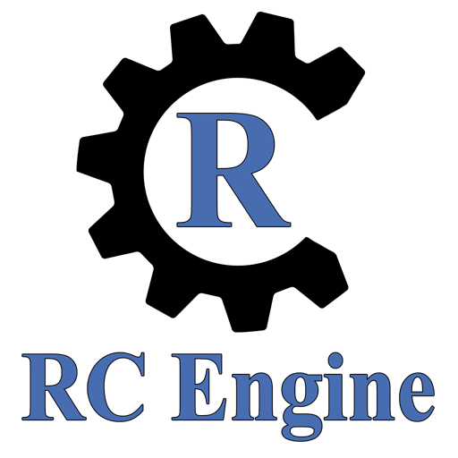

# RC-Engine

RC-Engine is an open-source 3D game engine using Vulkan.

# Building the project
Requirements for compiling and building the project:
- Windows operating system
- Visual Studio 2015
- LunarG Vulkan SDK 1.0.26.0 installed in default location (for custom path, modify project settings)

After compile, executables can be found in the "bin" directory inside the project directory.

# RC-Engine tools
Useful tools for creating or converting assets can be found [here](https://github.com/Ruscris2/RC-Engine-Tools).
